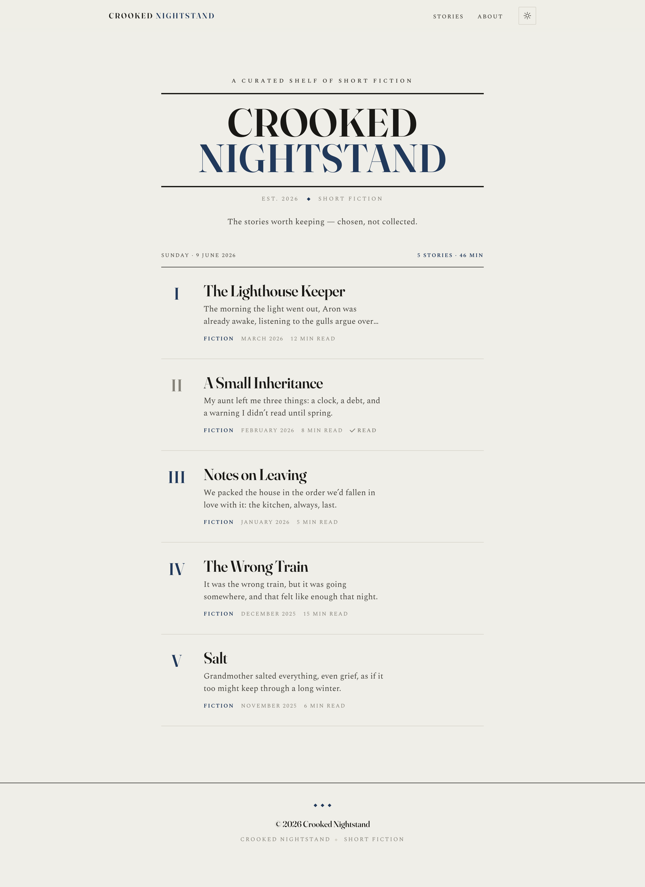
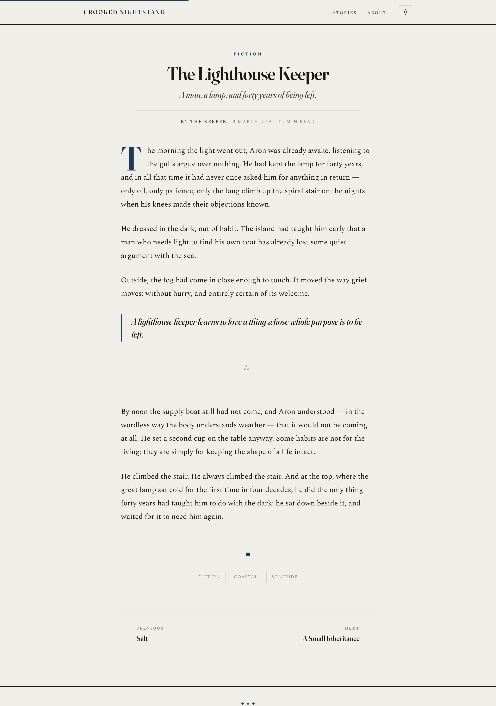

# Crooked Nightstand

A literary-press Ghost theme for a curated shelf of short stories — in two colour
editions. The theme itself is identical; the editions differ in their **accent
colour** and **favicon**.

<p>
  
  
</p>

The home page and the reading view with the navy accent. Both are screenshots of static
test pages in `mockups/` (`verify-home.html`, `verify-post.html`), which load the theme
stylesheet over placeholder text.

The theme is Handlebars templates, one stylesheet and one script with no dependencies;
fonts load from Google Fonts. Nothing needs compiling: `build.sh` only assembles the two
zips.

## Folder structure

```
theme/                       The shared theme source (edit here, then ./build.sh)
brand/
  pink/  favicon.svg, favicon-512.png
  blue/  favicon.svg, favicon-512.png
dist/
  crooked-nightstand-pink.zip   ← upload this to Ghost for the pink edition
  crooked-nightstand-blue.zip   ← …or this for the blue edition
build.sh                     Rebuilds both zips from theme/ + brand/
mockups/                     Design explorations & verification (not part of the theme)
```

## The two editions

| | Pink | Blue |
| --- | --- | --- |
| Accent | **Follows your Ghost Branding colour** (default fallback navy) | **Locked to navy** `#21395B` |
| Favicon | Crooked book-stack, pink top (`#E84A7F`) | Crooked book-stack, blue top (`#5E82C8`) |
| Pick it if… | you want to set/tune the accent in Ghost admin | you want navy out of the box, no setup |

Both favicons are **light** (paper background + ink books) to match the site, and the SVG
adapts to dark-mode browser tabs automatically. The `favicon-512.png` is the light version
you upload to Ghost.

Both zips pass gscan, Ghost's theme validator, for Ghost 5 and for Ghost 6 with no errors
or warnings (gscan 6.6.1: `npx gscan -z dist/crooked-nightstand-blue.zip`, with `--v5`
added for Ghost 5). The GitHub Actions workflow in `.github/workflows/ci.yml` runs the
same checks on pushes to `main` and on pull requests, against `theme/` and against both zips.

## Install (either edition)

1. **Theme** — Ghost admin → **Settings → Design → Change theme → Upload**, choose the
   edition's zip from `dist/`, then **Activate**.
2. **Favicon** — **Settings → General → Publication identity → Icon**, upload the matching
   `brand/<edition>/favicon-512.png`. Ghost generates the rest.
3. **Title** — **Settings → General → Title** → `Crooked Nightstand`.
4. **Accent colour**
   - **Pink:** **Settings → Design → Branding → Accent color** → your pink (Ghost's default
     is already a pink). Everything — links, numerals, drop cap, marks — follows it.
   - **Blue:** nothing to do; the navy is baked in. (Optional: set the Branding accent to
     `#21395B` too, so the members/subscribe portal matches.)

## Rebuilding

Edit the shared source in `theme/`, then:

```bash
./build.sh
```

This regenerates both `dist/` zips (swapping in each edition's favicon, and hard-coding the
navy accent for the blue build). It needs `zip` and `perl`. To change a colour, edit
`brand/<edition>/favicon.svg` and, for blue, the `--accent` value near the top of
`theme/assets/css/screen.css`. `build.sh` looks for that exact navy value (`#21395B`) when
it locks the blue build, so change it there as well.

See `theme/README.md` for the full theme documentation (templates, options, features).

## License

MIT. See [LICENSE](LICENSE).
